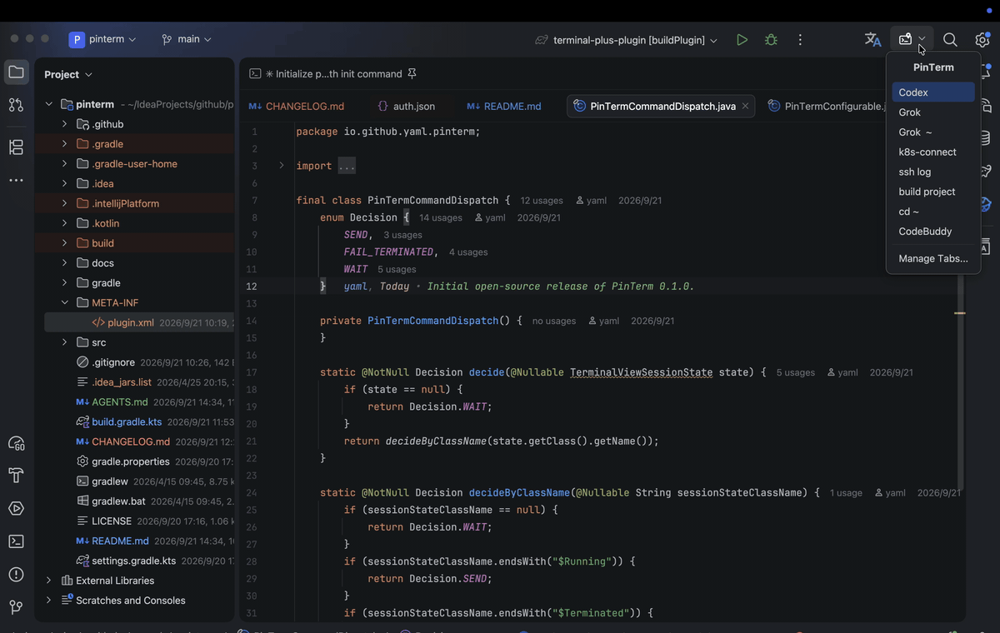
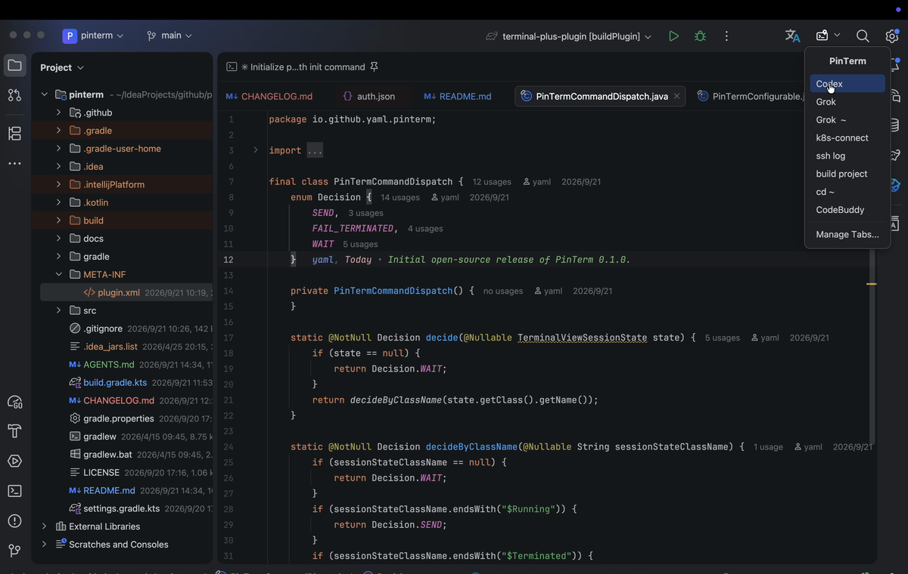
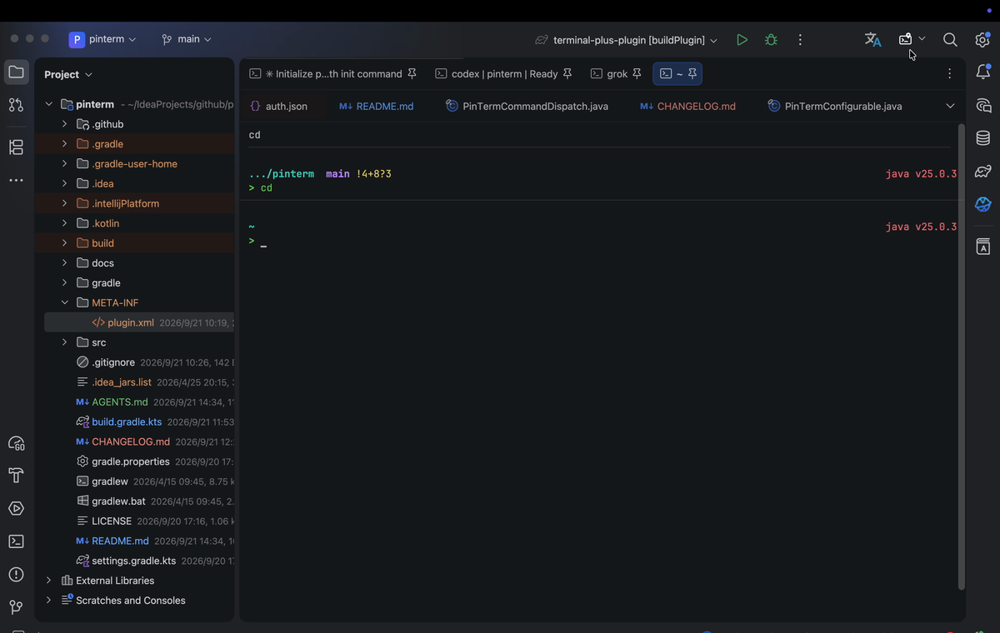
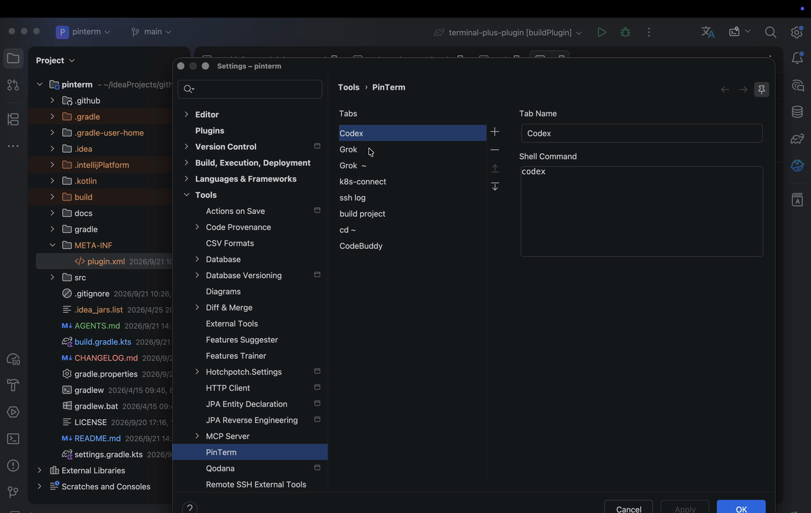

# PinTerm

PinTerm is an IntelliJ Platform plugin that opens configured terminal tabs in the editor, pins them, and can send a one-line shell command once the session is running.

PinTerm 是一个 IntelliJ Platform 插件：把预设终端打开到编辑器区域、自动固定标签，并在会话就绪后按需发送一行 shell 命令。首次安装时会打开 IDE 全局的「固定标签单独一行」，让钉住的终端和普通编辑器标签分开。

PinTerm is not a sandbox. Installing it gives the plugin the same privileges as the IDE. Clicking a tab can run a configured command as the current user.



> 以上是**真实操作录屏**（IDE 实机）：工具栏下拉选择标签 → 终端在编辑器区打开并固定（固定标签单独成行）→ 会话就绪后自动执行命令 → 回到 `Settings / Tools / PinTerm` 配置页。

| 工具栏下拉选择标签 | 终端固定到编辑器并执行命令 | 配置界面 |
| --- | --- | --- |
|  |  |  |

素材生成方式（从录屏抽帧）见 [docs/DEMO.md](docs/DEMO.md)。

## 功能

- 主工具栏右侧提供仅图标的下拉入口。
- 在 `Settings / Tools / PinTerm` 中维护多个终端标签（名称 + 单行命令）。
- 将选中的终端打开到编辑器区域，而不是留在 Terminal 工具窗口。
- 自动固定打开的终端标签。
- 首次安装时启用 **Show pinned tabs in a separate row**（只改一次，之后尊重用户自己的选择）。
- 终端进入运行态后，可发送配置的单行命令。不可信项目不会发送命令。
- 项目关闭或插件卸载前，清理由 PinTerm 打开的终端。

## 要求

- IntelliJ IDEA 2026.2 或更新（build `262+`）
- Reworked Terminal（IDE 自带 Terminal 插件）
- 构建默认使用本机安装的 IntelliJ IDEA；没有时退化为下载式平台，见[从源码构建](#从源码构建)
- 编译插件源码需要 JDK 25（本机 IDEA 2026.2 的平台字节码是 Java 25）
- 运行 Gradle 8.13 守护进程请用 JDK 21（Kotlin DSL 解析不了 Java 25.0.3 这类版本号）

## 使用

1. 安装插件后，工具栏右侧会出现 PinTerm 图标。首次安装下拉里有 **Codex**（`codex`）、**Claude**（`claude`）、**Grok**（`grok`）。
2. 打开 `Settings / Tools / PinTerm`，新增或编辑 tab：
   - **Tab Name**：显示名，保存时不能为空、不能重复。
   - **Shell Command**：可选，必须是单行。
3. 从工具栏下拉选择一个 tab，终端会打开在编辑器中并固定。
4. 如需固定标签单独成行：`Settings / Editor / General / Editor Tabs` → **Show pinned tabs in a separate row**（插件首次启动会帮你打开）。

不要把 PinTerm tab 起成和普通 Terminal 会话相同的名字。项目关闭时，插件会按**当前配置里的 tab 显示名**清理 Terminal 的持久化记录。编辑器里的标签只关带 PinTerm 标记的文件；该标记过不了 IDE 重启，所以崩溃后留在编辑器里的终端不会再被启动清理关掉。

## 风险与信任模型

1. **命令即执行**：`Shell Command` 在终端 Running 后原样 `shouldExecute` 发送，权限 = 当前用户。插件不解释、不沙箱。
2. **`pinterm.xml` 是可信输入**：能改该文件就能改将要执行的命令。加载和发送都会拒绝换行和空字符。不要把密钥写进 command。
3. **命令不漫游**：`pinterm.xml` 关闭了 Settings Sync 漫游，避免把可执行命令同步到其它机器。
4. **cwd = 当前项目** 的 `basePath`（或 `guessProjectDir`），不是 tab 级配置。换项目会用同一条命令、不同工作目录。
5. **不可信项目**：终端仍会打开，但不会发送配置的命令。
6. **持久化清理按 tab 显示名**：只匹配**当前配置里出现过的名字**。不要和普通 Terminal 同名，否则关项目 / 卸插件可能丢掉用户自己的会话记录。
7. **首次安装改的是 IDE 全局**「固定标签单独一行」，不是 PinTerm 自己的 tab。只改一次；改回路径：`Settings / Editor / General / Editor Tabs`。
8. 构建默认本机 `/Applications/IntelliJ IDEA.app`，用环境变量 / `-P` / `gradle.local.properties` 覆盖，路径不要入库。

## 配置模型

每个 tab：

- `id`
- `name`
- `command`

旧版单行 `shellScript` 会在加载时迁到 `command`。含换行的旧脚本会被丢弃，不会执行。不支持多行脚本、独立工作目录或环境变量。

## 从源码构建

不要把本机 IDEA / JDK 路径提交进仓库。本地覆盖方式任选其一：

- 环境变量：`PINTERM_LOCAL_IDE=/Applications/IntelliJ IDEA.app`
- Gradle 属性：`./gradlew test -PlocalIdePath=/path/to/IntelliJ IDEA.app`
- 仓库根目录的 `gradle.local.properties`（已 gitignore）：

```properties
localIdePath=/Applications/IntelliJ IDEA.app
```

未指定时，默认使用 `/Applications/IntelliJ IDEA.app`；该路径不存在时（例如 CI / 非 macOS）会退化为下载式平台，版本用 `-PplatformVersion=` 覆盖（默认 `2026.2.3`）。

Gradle 守护进程示例：

```bash
JAVA_HOME="$(/usr/libexec/java_home -v 21)" ./gradlew test
./gradlew buildPlugin
./gradlew runIde
```

插件包：`build/distributions/pinterm-0.1.0.zip`

## 发布

发布说明（changelog）以仓库根目录的 `CHANGELOG.md` 为**唯一来源**，遵循 Keep a Changelog：每个版本一个 `## [<version>]` 段。同一段内容会：

- 作为 Git tag 的 GitHub Release 正文（`.github/workflows/release.yml` 用 `--notes-file` 传入）；
- 在构建期转成 HTML 写入产物 `plugin.xml` 的 `<change-notes>`（`build.gradle.kts` 里的 `patchPluginXml.changeNotes`），即 Marketplace 展示给用户的更新说明。

**所以发版前必须先为新的 `pluginVersion` 在 `CHANGELOG.md` 顶部补一段**，否则产物不带 change-notes，Release 会退化成 GitHub 自动生成的 notes。

发布步骤：

1. 更新 `gradle.properties` 的 `pluginVersion`，并在 `CHANGELOG.md` 顶部补上对应 `## [x.y.z]` 段。
2. 在 GitHub 仓库配置 secrets：

   | secret | 必需 | 说明 |
   | --- | --- | --- |
   | `PUBLISH_TOKEN` | 是 | JetBrains Marketplace 永久 token（[作者页](https://plugins.jetbrains.com/author/me/tokens)）。首次发布需先在 Marketplace 手动上传一次以登记插件。 |
   | `CERTIFICATE_CHAIN` | 否 | 插件签名证书链。 |
   | `PRIVATE_KEY` | 否 | 签名私钥。 |
   | `PRIVATE_KEY_PASSWORD` | 否 | 私钥口令。 |

   签名变量缺失时 `signPlugin` 会跳过，发布**未签名**插件。

3. 打 tag 并推送：

   ```bash
   git tag v0.1.0
   git push origin v0.1.0
   ```

`.github/workflows/release.yml` 随后自动执行 `test` → `buildPlugin` → `publishPlugin` → 创建 GitHub Release（标题为 tag 名，正文取 `CHANGELOG.md` 当前版本段，并附带 `build/distributions/pinterm-<version>.zip`）。tag 名 `v0.1.0` 会作为 `pluginVersion` 传入（剥掉 `v` 前缀）；手动触发（`workflow_dispatch`）则取 `gradle.properties`，且不创建 Release。

推送 `main` / 提交 PR 时，`.github/workflows/ci.yml` 会跑 `test` + `buildPlugin` 并上传 zip。

Marketplace 侧的「自动更新」由平台提供：只要发布了 `version` 更高的包，IDE 客户端就会提示更新，无需插件端额外逻辑。

**Media（截图）需手工上传。** 插件页的截图区不随插件包发布，`publishPlugin` 不会上传，也不被 Gradle 版本管理。素材在 `docs/screenshots/`：真实截图与演示 GIF 都是 `1200×760`（Marketplace 要求的尺寸与比例），README 与插件页**共用同一份**，不会出现两处漂移。上传步骤见 [docs/DEMO.md](docs/DEMO.md)「八、Marketplace Media 素材」。

## 已知限制

- 依赖 Reworked Terminal 内部 API，`sinceBuild` 为 `262`；升级 IDE 后这些 API 可能再变。
- 本地没有 IDEA 时改用下载式平台，因此可在 CI（GitHub Actions）构建；自动发布到 Marketplace 需自行配置 secrets，见[发布](#发布)。
- 发布说明需人工维护：发版前要为新的 `pluginVersion` 在 `CHANGELOG.md` 顶部补一段，见[发布](#发布)。
- 没有「真实打开 IDE 终端并固定」的集成测试。
- 不支持按 tab 配置工作目录或环境变量。
- `OWNED` 标记存在 VirtualFile UserData 上，IDE 重启后通常丢失。
- Marketplace / 设置页图标是 `META-INF/pluginIcon.svg`；工具栏图标是 `/icons/pinterm.svg`。
- 安装、更新、卸载声明为不需要重启（`require-restart="false"`）。从磁盘安装 zip 时，平台有时仍会提示重启。

## 验证（Plugin Verifier）

JetBrains Plugin Verifier 对 0.1.0 的结论：

- IntelliJ IDEA 2026.2.3：Compatible（5 处 deprecated、42 处 experimental、15 处 internal API）
- IntelliJ IDEA 2026.3 eap (263.5153.40)：Compatible（同上）
- IDE 实机运行：`No issues occurred during the IDE run with the plugin installed`

这些计数是提示，不是不兼容，目前都是有意保留的：

- deprecated（5）：全部是 `Disposer.isDisposed(Disposable)`。2026.2 编译期 API 提供的 `Disposable` 只有 `dispose()`，没有 `isDisposed()`，没有等价替代，所以保留；5 处都在 `PinTermService` 的终端文件与命令会话清理路径上。
- experimental（42）：全部来自 Reworked Terminal 的编辑器/标签/会话接口（`TerminalToolWindowTabsManager`、`TerminalToolWindowTab`、`TerminalToolWindowTabBuilder`、`TerminalView`、`TerminalViewSessionState`、`TerminalSendTextBuilder`）。把终端开进编辑器并固定就是这些接口提供的，绕不开。
- internal（15）：Reworked Terminal 的持久化接口（`TerminalTabsStorage`、`TerminalSessionPersistedTab`）、`StartupManager.runAfterOpened`、`AppLifecycleListener.appStarted`、以及 `UISettings.getState()` / `UISettingsState` 的固定标签设置。它们没有公开替代（`postStartupActivity` 只接受 Kotlin suspend 的 `ProjectActivity`；平台自己的 `CreateAllServicesAndExtensionsActivity` 也用 `appStarted`），改动只会把风险转移到运行时行为上。

## License

MIT
